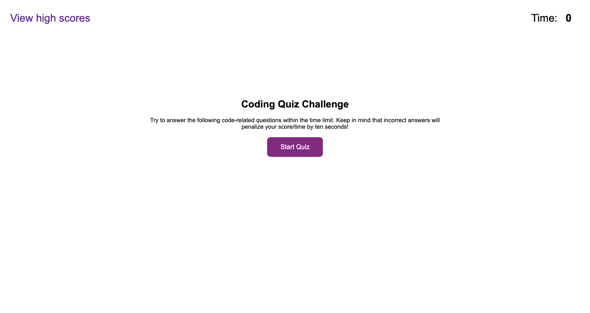

# Code-Quiz

#### Version 1.0

### Description:
An application that allows a student to take a timed quiz on Javascript fundamentals that stores high scores. It also allows the student to gauge the progress compared to peers.

### Languages used:
- HTML
- CSS
- JavaScript

### First Glance of the app:

### Usage:
This app will run in the **browser**. 

### Hosted here: 
[GithubPages](https://archana-nagaraj.github.io/Code-Quiz/)

### Contact
- Name: [Archana Nagaraja](https://archana-nagaraj.github.io/Professional-Portfolio/)
- Project Link: [Github](https://github.com/archana-nagaraj/Code-Quiz)